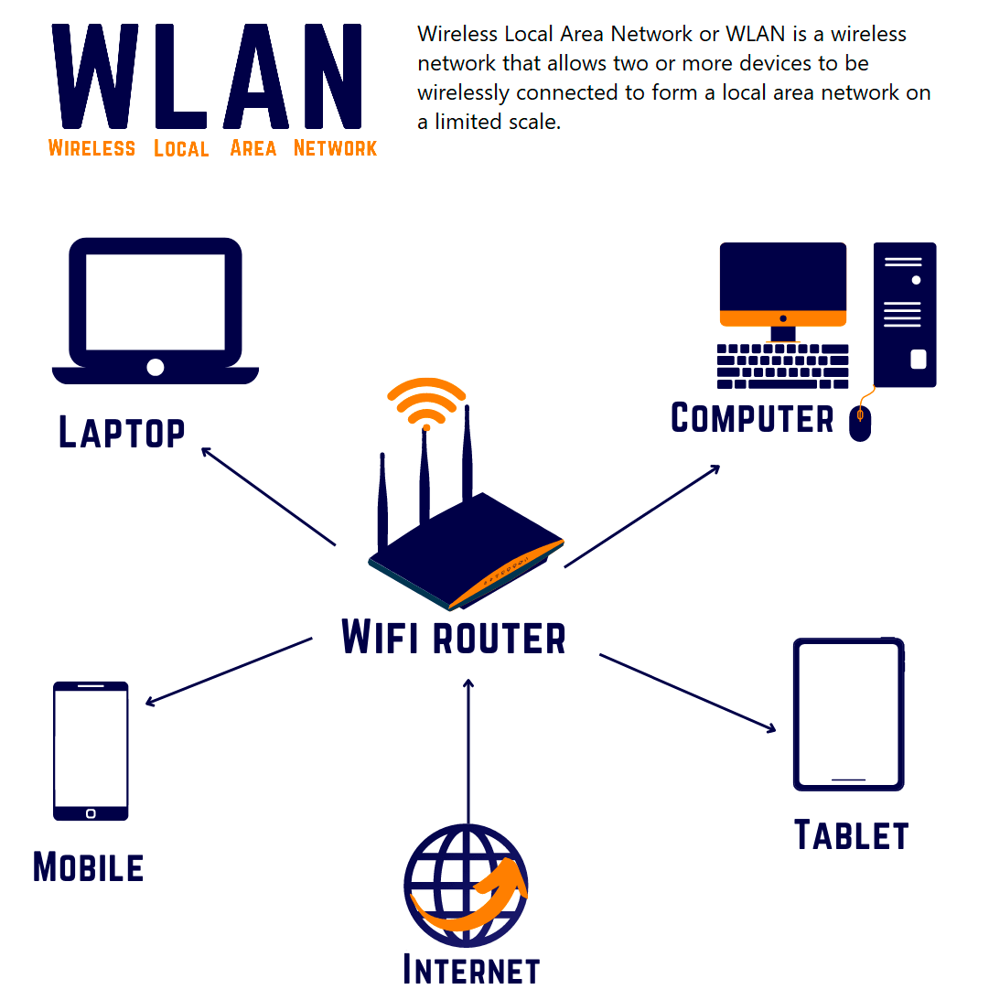
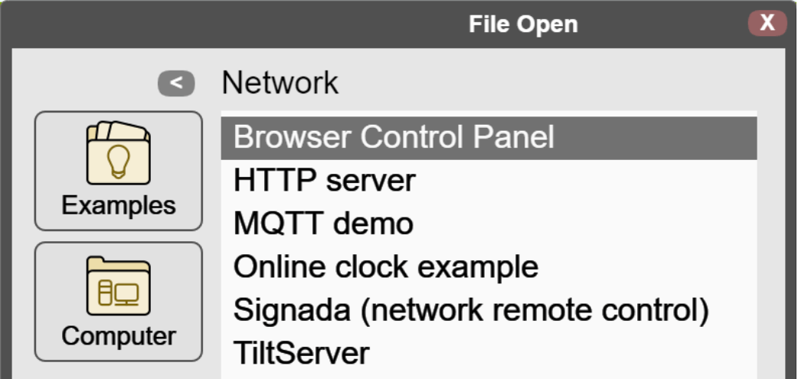
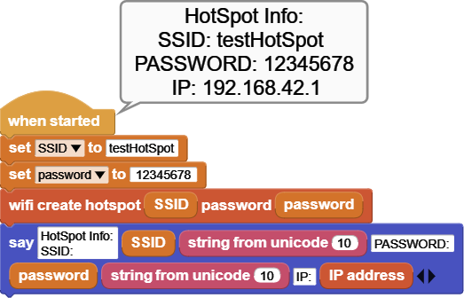
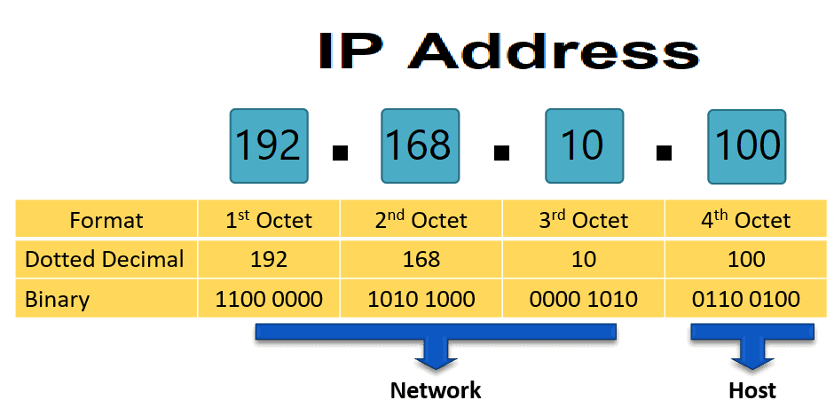
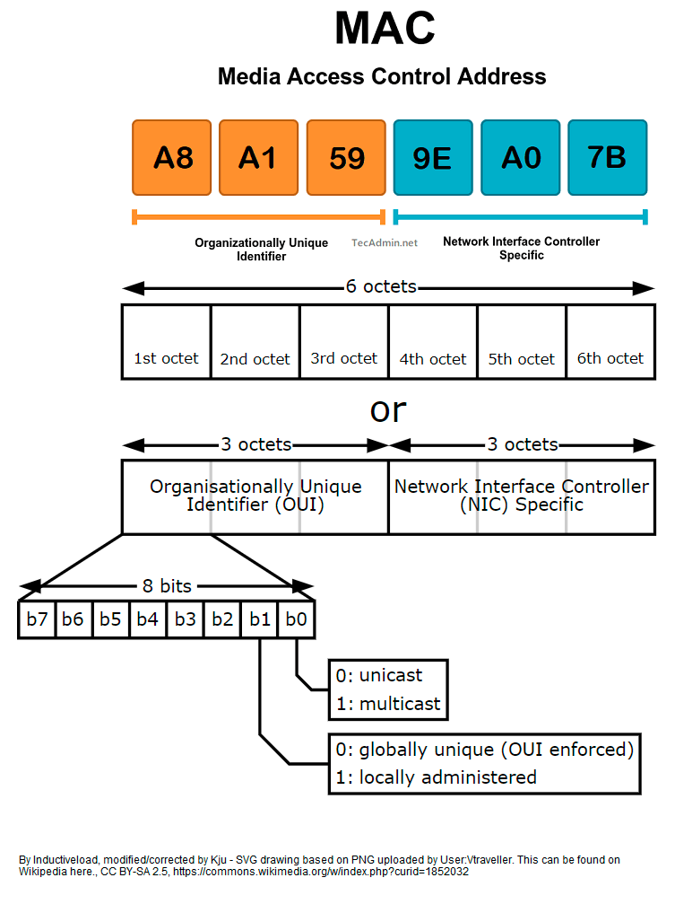

# 无线上网
支持使用 AP 和热点模式进行 WIFI 通信的模块。
## 概述
   

MicroBlocks WIFI 库支持许多具有 WIFI 功能的微控制器板。只需几个简单的块，就可以轻松设置 WIFI 连接来参与本地 IP 基础设施；甚至创建一个基于热点的网络。

该库构成了更高级的基于 WIFI 的应用程序的基础，其中使用众多 IP 协议之一来构建应用程序；例如：WebSocket、UDP、HTTP、MQTT 等。有单独的库和示例提供了如何实现这些功能。

有关WIFI 项目的一些示例，请参阅我们 WIKI 中的[WIFI 远程控制]()文章。您还可以尝试 IDE 的“文件”/“打开”/“示例”/“网络”菜单中提供的示例之一：

## 积木介绍
对于每个块，都有一个简短的描述条目以及详细的块和组件描述。您可以单击简短描述表中的框图来访问详细信息和示例代码。

已提供有关如何使用这些块的示例代码。要试用它们，您只需打开 MicroBlocks IDE 的浏览器会话并将它们拖放到编辑器编程区域即可。然后您只需单击它们即可查看结果。

> 要测试下面的任何示例代码，只需将它们拖放到 MicroBlocks IDE 上即可。

简短的介绍
	用于连接到本地IP网络。
	使用给定凭据创建热点。
	返回获取的IP地址。
	返回 WIFI 设备的 MAC 地址。
使用库积木
WebSocket 库有两种不同类型的块形状：

- 椭圆形：这些是返回某种信息的报告块。用户通常会将它们分配给项目变量或在其他块的合适输入槽中使用它。
- 矩形：这些是执行编程功能且不返回任何信息的命令块。
积木描述
> 这些库块仅适用于具有 WIFI 功能的微控制器板；例如：ESP8266和ESP32系列、PICO2040等。

请确保您使用特定于您的网络环境的 WIFI 凭据。
这里使用的只是为了示例目的，不会起作用。

## WIFI连接到

该块用于使用提供的凭据登录本地 IP 网络。登录过程完成后，将从本地路由器获取 IP 地址。

示例代码
此示例演示连接到本地 WIFI 网络。显示 WIFI 凭据。

请记住替换您自己的 SSID 和密码值。

## WIFI创建热点

如果附近没有可用的 IP 网络，则可以让微控制器创建一个热点来提供此访问服务。在这种情况下，微控制器充当接入点 (AP)，就像路由器在普通 WIFI 网络示例中的作用一样。热点建立后，所有远程设备都可以连接到该热点并直接从热点设备获取其 IP 地址。

确保您使用的密码是STRING类型，并且长度至少为8 个字符。至少在Windows环境中，操作系统不允许创建“无密码”热点（开放访问热点）。有关如何验证密码变量类型的脚本图​​片如下：

当您仅在下拉菜单中选择字符串时，该字段将从椭圆形白色变为矩形白色。请参阅下面的示例。

> 请注意，正常情况下，热点不提供互联网接入。
它只是本地设备相互通信的一种手段。

示例代码
在此示例中，我们对微控制器进行编程，以使用给定的凭据创建热点。成功完成热点启动后将显示热点详细信息。

请注意，在这种操作模式下，正常情况下无法访问互联网。此外，热点分配的IP 地址范围将与 Internet 路由器分配的范围不同。

## IP地址

> 来自免费百科全书维基百科
互联网协议地址（IP 地址）是一个数字标签，例如 192.0.2.1，它连接到使用互联网协议进行通信的计算机网络。IP 地址有两个主要功能：网络接口标识和位置寻址。
Internet 协议版本 4 (IPv4) 将 IP 地址定义为 32 位数字。然而，由于互联网的发展和可用 IPv4 地址的耗尽，使用 128 位 IP 地址的新版本 IP (IPv6) 于 1998 年标准化。IPv6 部署自 2000 年代中期以来一直在进行。
IP 地址以人类可读的符号书写和显示，例如 IPv4 中的 192.0.2.1 和 IPv6 中的 2001:db8:0:123:0:567:8:1。
地址的路由前缀的大小以CIDR表示法通过在地址后加上有效位数的后缀来指定，例如192.0.2.1/24，其相当于历史上使用的子网掩码255.255.255.0。

当微控制器设备与互联网路由器之间成功建立连接或启动热点时；已分配 IP 地址。

在正常互联网连接的情况下，这是互联网路由器的 DHCP 分配的地址。对于热点，地址由微控制器设备分配。

示例代码
这不是一个完整的程序，而是显示分配的 IP 地址的块结果。

MAC地址

> 来自维基百科，免费百科全书
媒体访问控制地址（MAC 地址）是分配给网络接口控制器（NIC）的唯一标识符，用作网段内通信中的网络地址。这种用途在大多数 IEEE 802 网络技术中都很常见，包括以太网、Wi-Fi 和蓝牙。正如通常所表示的，MAC 地址可识别为六组两个十六进制数字，由连字符、冒号分隔或不使用分隔符。

示例代码
这不是一个完整的程序，而是一个显示 WIFI 设备 MAC 地址的块结果。

