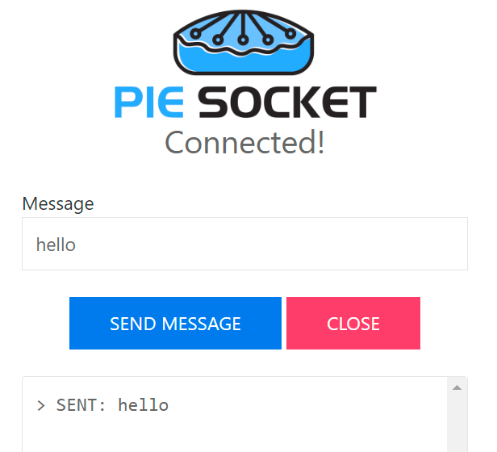

# WebSocket Server WebSocket服务器
用于实现一个简单的 WebSocket 服务器的块，最多支持 5 个客户端。

 ## 概述
 由维基百科和 web.dev 提供

 WebSocket 协议支持 Web 浏览器（或其他客户端应用程序）和 Web 服务器之间的交互，其开销比 HTTP 轮询等半双工替代方案更低，从而促进与服务器之间的实时数据传输。
 这是通过为服务器提供一种标准化方式来将内容发送到客户端而无需客户端首先请求，并允许在保持连接打开的同时来回传递消息来实现的。这样，客户端和服务器之间就可以进行双向持续对话。
 通信通常通过 TCP 端口号 443（或在不安全连接的情况下为 80）完成，这对于使用防火墙阻止非 Web Internet 连接的环境是有益的。

 Sockets 

 使用 WebSocket 协议通信的设备必须存在于共享 IP 网络上，例如：本地 WIFI。
 首先要做的是使用 WIFI 库块登录本地 IP 网络并获取 IP 地址。 IP 地址将用于与服务器通信，因此最好记下它。以后总是可以通过 WIFI 库的 IP 地址块查找它：

一旦服务器设备位于本地 IP 网络上，最多五个远程设备可以与其建立链接并使用双向连接交换数据。每个远程连接都分配有一个 ClientID (0-4)，可用于有选择地寻址各个远程连接以进行数据交换。

有关多个客户端与 Websocket 服务器交互的示例，请参阅 WIKI 中的使用 WebSocket 进行 WiFi 远程控制文章。
[使用 WebSocket 进行 WiFi 远程控制？？](../使用 WebSocket 进行 WiFi 远程控制.md)

## 积木介绍
对于每个块，都有一个简短的描述条目以及详细的块和组件描述。您可以单击简短描述表中的框图来访问详细信息和示例代码。
已提供有关如何使用这些块的示例代码。要试用它们，您只需打开 MicroBlocks IDE 的浏览器会话并将它们拖放到编辑器编程区域即可。然后您只需单击它们即可查看结果。

> 要测试下面的任何示例代码，只需将它们拖放到 MicroBlocks IDE 上即可。

开始运行 WebSocket 服务器。

返回最后收到的协议消息。

返回 WebSocket 客户端 ID (0-4)。

返回收到的消息的内容。

返回 WebSocket 事件类型。

使用指定 ID 客户端发送消息。

## 积木使用
WebSocket 库有两种不同类型的块形状：
- 椭圆形：这些是返回某种信息的报告块。用户通常会将它们分配给项目变量或在其他块的合适输入槽中使用它。
- 矩形：这些是执行编程功能且不返回任何信息的命令块。

### 启动 WebSocket 服务器

一旦 WIFI 登录完成并从本地路由器获取 IP 地址，此块就会启动 WebSocket 服务器。在典型的用例中，您需要实现一个消息循环，该循环将从客户端接收数据包并根据其内容调度它们。
有关各种示例，请参阅 WIKI 的[使用WebSocket进行WiFi远程控制](使用WebSocket进行WiFi远程控制.md)方法部分。

示例代码

本示例演示登录本地WIFI，然后启动Websocket服务器。显示 WIFI 凭据。
记住替换您自己的 SSID 和密码值。

### 上次 WebSocket 事件
协议收到的每条消息都被视为一个事件。事件对象在下面的其他块中用于链接和解密消息及其内容部分。当没有事件时，默认值为 false。

示例代码
在此示例中，检测到 WebSocket 事件并从传入数据包中提取 clientID 数据。

### WebSocket 事件的客户端 ID
服务器和客户端之间建立的每个连接都会分配一个套接字号，也称为客户端 ID (0-4)。 MicroBlocks 的最大数量为 5 个客户端。

示例代码
在此示例中，检测到 WebSocket 事件并从传入数据包中提取 clientID 数据。

### WebSocket 事件的有效负载
这是收到的消息的实际内容。

示例代码

### WebSocket 事件类型
WebSocket 消息被归类为事件。有几个：
错误、断开连接、已连接、短信、二进制消息、文本片段开始、二进制片段开始、片段、片段结束、ping、pong、等待

示例代码
在此示例中，远程客户端（Pie Socket）正在发送一条内容为 hello 的消息。该事件由服务器检测到，并且事件类型被识别为“文本消息”。

### 发送到 WebSocket 客户端

通过此块，我们可以使用其客户端 ID 向连接到服务器的任何客户端发送消息。

示例代码
在此示例中，服务器正在向远程客户端 #0 (Pie Socket) 发送一条文本消息，内容为 Hello，Client #0!。远程客户端（Pie Socket）接收消息并将其显示在其控制台上。
