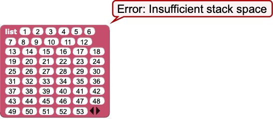
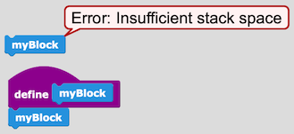
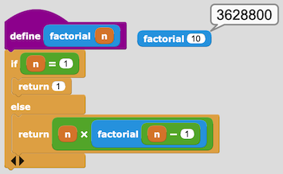
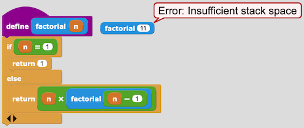
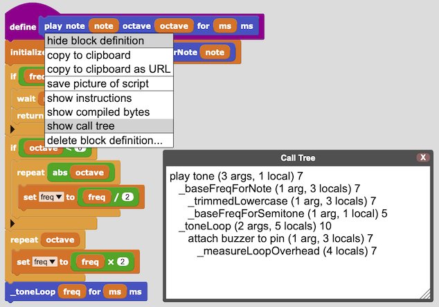

# 故障排除
如何认识和解决问题

(注：这是一项正在进行的工作。)

## 无法通过 USB 连接
以下是需要检查的事项：

- 开发板上是否已安装 MicroBlocks 固件？
- 如果您在浏览器中运行 MicroBlocks，是 Chrome 还是 Edge？ （浏览器必须支持 WebSerial API。）
- 开发板是否通过 USB 串口线连接到电脑？
- USB串口线是数据线吗？ （仅充电的电缆不起作用。）它是否良好？如果有可用的电缆，请尝试使用另一根电缆。

## 运行时错误列表
以下是可能的运行时错误消息的列表：

- Insufficient memory to allocate object - 内存不足，无法分配对象
- Needs a list - 需要一个清单
- Needs a boolean - 需要一个布尔值
- Needs an integer - 需要一个整数
- Needs a string - 需要一个字符串
- Those objects cannot be compared for equality - 这些对象无法比较相等性
- List size must be a non-negative integer - 列表大小必须是非负整数
- List or string index must be an integer - 列表或字符串索引必须是整数
- List or string index out of range - 列表或字符串索引超出范围
- A ByteArray can only store integer values between 0 and 255 - ByteArray 只能存储 0 到 255 之间的整数值
- Hexadecimal input must between between -1FFFFFFF and 1FFFFFFF - 十六进制输入必须介于 -1FFFFFFF 和 1FFFFFFF 之间
- I2C device ID must be between 0 and 127 - I2C 设备 ID 必须介于 0 到 127 之间
- I2C register must be between 0 and 255 - I2C 寄存器必须介于 0 到 255 之间
- I2C value must be between 0 and 255 - I2C 值必须介于 0 到 255 之间
- Attempt to access an argument outside of a function - 尝试访问函数外部的参数
- for-loop argument must be a positive integer or list - for 循环参数必须是正整数或列表
- Insufficient stack space - 堆栈空间不足
- Primitive not implemented in this virtual machine - 原语未在此虚拟机中实现
- Not enough arguments passed to primitive - 没有足够的参数传递给原语
- The maximum wait time is 3600000 milliseconds (one hour) - 最大等待时间为3600000毫秒（一小时）
- This board does not support WiFi - 该板不支持WiFi
- Division (or modulo) by zero is not defined - 未定义除以零（或取模）
- Argument index out of range - 参数索引超出范围
- Needs an indexable type such as a string or list - 需要可索引类型，例如字符串或列表
- All arguments to join must be the same type (e.g. lists) - join 的所有参数必须是相同的类型（例如列表）
- I2C transfer failed - I2C 传输失败
- Needs a byte array - 需要一个字节数组
- Serial port not open - 串口未打开
- Serial port write is limited to 128 bytes - 串口写入限制为128字节
- Needs a list of integers - 需要一个整数列表
- Needs a value between 0 and 255 - 需要 0 到 255 之间的值
- Range increment must be a positive integer - 范围增量必须是正整数
- Needs an integer or a list of integers - 需要一个整数或整数列表
- Not connected to a WiFi network - 未连接到 WiFi 网络
- Cannot convert that to an integer - 无法将其转换为整数
- Cannot convert that to a boolean - 无法将其转换为布尔值
- Cannot convert that to a list - 无法将其转换为列表
- Cannot convert that to a byte array - 无法将其转换为字节数组
- Unknown datatype - 未知数据类型
- Unicode values must be between 0 and 1114111 (0x10FFFF) - Unicode 值必须介于 0 和 1114111 (0x10FFFF) 之间
- Cannot use this feature when board is connected to IDE via Bluetooth - 当开发板通过蓝牙连接到 IDE 时，无法使用此功能
- Needs an 8-bit bitmap: a list containing the bitmap width and contents (a byte array) - 需要一个 8 位位图：包含位图宽度和内容的列表（字节数组）
- Needs a color palette: a list of positive 24-bit integers representing RGB values - 需要一个调色板：表示 RGB 值的 24 位正整数列表

如果您知道哪个块产生错误，则错误消息可以帮助您找出问题所在。例如，如果消息是“需要一个列表”，则该块的输入之一需要一个列表，但正在传递某种其他类型的值（例如数字或字符串）。

不幸的是，MicroBlocks 目前不会告诉您哪个块导致了错误。因此，您可能需要做一些实验来隔离问题。例如，您可以溢出脚本来查看错误是否发生在脚本的第一部分。如果脚本的该部分运行时没有错误，您可以添加片段，直到发生错误。如果脚本的第一部分出现错误，您可以进一步拆分该部分。

错误消息应尽可能不言自明。有些明显与特定功能相关。例如，提及“I2C”的错误消息与 I2C 通信块相关联。

## 常见运行时错误
### ByteArray 只能存储 0 到 255 之间的整数值
与列表不同，字节数组只能存储数字（不能存储字符串、布尔值或其他对象），并且这些数字必须介于 0 到 255 之间。如果您尝试将非数字或超出该范围的数字存储到字节中，则会出现此错误大批，

### 内存不足，无法分配对象
MicroBlocks 从固定大小的内存池中为列表、字符串和字节数组分配内存。可用内存量因主板而异。当对象不再被使用时，内存将被回收。

当没有足够的内存来满足请求时，就会出现此错误。例如，如果您尝试创建太大而无法容纳可用内存的列表，则会收到此错误。

数据类别中的空闲内存块报告可用内存的字数。单击停止按钮将清除所有全局变量（将其值设置为零）并释放所有分配的对象，从而最大化可用空间量。

### 堆栈空间不足
当函数调用堆栈变得太深时会出现此错误。这种情况在小型、简单的项目中并不常见，但当用户创建更大、更复杂的项目时可能会发生。

导致此错误的一个可能原因是使用带有大量参数的列表块：

这是一个极端的例子，但即使是具有十个或二十个元素的列表块在与堆栈的其他用途结合使用时也可能导致此错误。

有时，最好通过一次添加一个元素或在列表的字符串表示形式上使用split块来构建大型列表。

错误的另一个可能原因是深度（或无限）递归。当函数包含对其自身的直接或间接调用时，可能会发生意外递归：

在 MicroBlock 中可以进行有限深度的有意递归。例如这有效：

但不是这个：

堆栈空间不足错误的另一个可能原因是深度嵌套的调用序列。这个问题通常可以通过一些程序重组来解决。高级用户可以使用一个有用的工具来了解其函数的结构，即函数定义块上的show call tr​​ee命令：

为了避免耗尽堆栈空间，应该避免深度嵌套调用，即在调用树报告中深度缩进的调用。在示例中，对measureLoopOverhead 的调用深度为四个级别。它使用 7 + 10 + 7 + 7 = 31 个字的堆栈空间。最大堆栈大小略多于 50 个字，因此该程序不会超出堆栈空间。

