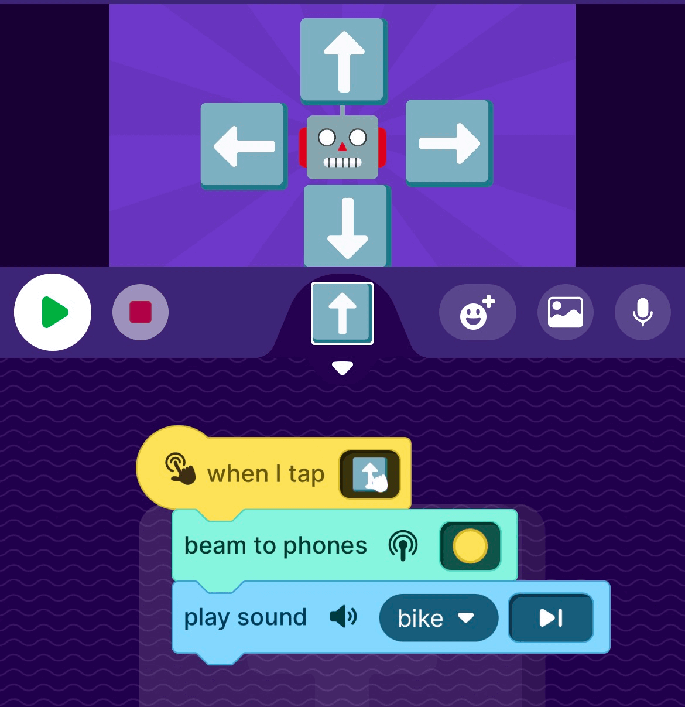

使用 OctoStudio 远程控制 micro:bit Maqueen 机器人
无线控制通过 5 个 OctoStudio 波束形状（向前圆形、向后三角形、向左星形、向右心形、方形停止）进行。

## 概述
该项目可让您使用在智能手机上运行的 OctoStudio 控制 micro:bit Maqueen 机器人。感谢文杰的努力和启发！
[破解 OctoStudio - 夜行人](https://wwj718.github.io/post/%E7%BC%96%E7%A8%8B/extend-octostudio/)

## 组件
要开始项目所需的硬件。
- 主控板
Micro:bit V2

兼容 Micro:bit 的其他板子

- 机器人小车套件，例如带有兼容微控制器板（例如 micro:bit v2）的 DF Robot Maqueen (Lite)

- 安装了 OctoStudio 应用程序的智能手机（iOS 或 Android）

- 运行 MicroBlocks IDE 

## 步骤
使用支持 Octo 的固件刷新微控制器

- 选项1：使用PlatformIO构建您自己的smallvm镜像
- 选项2：将此[hex固件文件](microbit-OctoStudio-20231202.hex ':ignore')拖放到笔记本电脑文件系统管理器中显示的 micro:bit v2 上

搭建机器人小车
按照供应商的说明。本文使用 DF Robot Maqueen (Lite)。
[DF Robot Maqueen (Lite)](https://www.dfrobot.com/product-1872.html)

为小车进行编程
使用下面的 MicroBlocks 脚本直接对 micro:bit v2 进行编程（拖到您的 MicroBlocks IDE 或在 IDE 中打开文件）。您可以根据需要对其进行修改（如果您有不同的硬件，则这是必要的）。

创建一个 OctoStudio 控制器应用程序（或从下面的链接复制）
机器人脚本假设以下光束形状对应于五个机器人命令：
- circle => forward 圆圈=>前进
- triangle => back 三角形 => 后退
- star => left 星号 => 左
- heart => right 心=>右 
- square => stop 正方形 => 停止

示例 OctoStudio 应用程序
[OctoStudio app](https://wiki.microblocks.fun/octostudio/robot_controller.octostudio)

## 玩
在此视频中查看正在实施的项目。
[this video](https://youtu.be/cYGMRPxTPAo)

## 讨论
该项目的成功得益于大部分免费的开源软件 (FOSS) 和一个非开源但免费使用的教育软件项目 (OctoStudio)。
- MicroBlocks IDE 和固件
- NimBLE 蓝牙堆栈（最初由 runtime.io 为 MyNewt 项目开发）
- Arduino框架和库（用于构建smallvm固件映像）
- PlatformIO构建系统