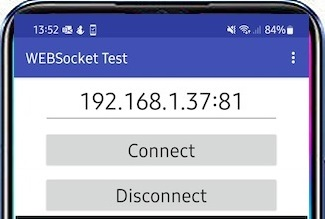

# 使用 WebSocket 进行 WiFi 远程控制
WebSocket 在 MicroBlocks 中的使用

## 概述
远程控制是控制项目时使用的一种非常方便的技术。无论是机器人汽车、房屋能源管理系统还是气象站；他们都可以从这种通信/控制方法中受益。

可以使用手边微控制器的任何可用通信功能来实现远程控制。蓝牙、串行通信、GSM、RF、WIFI 是我想到的方法。在本教程中，我们将特别关注基于 WIFI 的远程控制的使用，特别是使用WebSocket 协议的远程控制。

毫不奇怪，我们可以在 MicroBlocks WIFI 和 Websocket 服务器库的帮助下学习如何利用这项技术。虽然其他编程环境可能提供相同的功能，但 MicroBlocks 的实现特别简单和直接。

> “WebSocket 协议支持 Web 浏览器（或其他客户端应用程序）和 Web 服务器之间的交互，其开销比 HTTP 轮询等半双工替代方案更低，从而促进了服务器之间的实时数据传输。这是通过以下方式实现的：为服务器提供一种标准化方式，无需客户端首先请求即可将内容发送到客户端，并允许在保持连接打开的同时来回传递消息。通过这种方式，双方之间可以进行双向持续对话客户端和服务器。” - 由维基百科提供。

我们将学习如何传输和接收 WebSocket 消息，并通过打开和关闭板载 LED 来对消息内容进行操作。一旦掌握了这个练习，您就可以自己实现其他更复杂的控制系统。

为了让事情变得更有趣，也为了展示 MicroBlocks 最伟大的功能之一 -并行/多任务，本教程将同时支持最多五个用户，所有用户都在同一服务器上执行不同的操作。

可用于该项目的微控制器应具有几个共同特征：

- 他们应该支持WIFI
- 他们应该有一个板载 LED
- 他们应该有彩色显示屏，使程序操作更容易观察
在下图中，我们展示了带有集成彩色显示屏的 M5Stack 微控制器。您可能还有其他合适的选择。

除了MicroBlocks演示程序之外，我们还将为您提供Android手机的演示程序，以便您可以将其用作远程控制设备来参与本次练习并发送和接收消息。该应用程序允许您尝试许多远程控制选项：

- 发送和接收消息
- 控制模拟 RGB LED
- 流式传输时钟信息
- 练习套接字连接的循环，从而使您能够控制自己的电话。

## 组件

要完成本教程，您将需要：

- M5Stack Core 主控板
- 一部安卓手机
- 如果您没有 Android 手机，则可以安装适用于 Chrome 的PieSocket WebSocket Tester扩展并使用它。

## 建立联系
由于本练习利用了所用设备的 WIFI 功能，因此无需物理布线。

就 WIFI 可用性而言，您可以从使用家用路由器提供的 WIFI 开始。

您还可以使用 M5Stack 创建您自己的 WIFI 热点并提供您自己的 WIFI 信号。如果您计划在没有 WIFI 服务的区域进行操作，这将非常方便。

## 脚本
MicroBlocks 项目在WebSocket Demo.ubp程序中进行编码。
M5Stack 作为服务器，被编程为：

- 充当本地无线网络上的WIFI 客户端或成为提供 WIFI AP 服务的热点HOTSpot
- 支持最多五个客户端，全部可操作
- 发送、接收和显示消息
- 打开和关闭微控制器上的用户 LED
- 模拟四种不同颜色的 LED
- 将每个套接字置于环回模式

在下面的项目脚本图片中，

- 启动时块显示两个运行选项：连接到 WIFI和激活 HOTSpot。
- 当按下按钮 A 时，将处理本地 WIFI 连接的设置。显示连接信息并启动WSLoop处理Websocket消息。
- 当按下按钮 B 时，将处理HOTSpot模式的设置。显示连接信息并启动WSLoop处理Websocket消息。
- WSLoop设置项目变量，然后脚本进入接收消息并将它们分派到要处理的流程事件逻辑的循环。检查传入消息是否有新的客户端连接，如果找到，会将其添加到clientList变量中以对其进行跟踪。
- 处理事件脚本破译 WebSocket连接、断开连接和文本消息有效负载类型。文本消息有效负载被分派到processText脚本进行处理。
- processText脚本处理程序的所有主要消息。根据收到的有效负载，执行不同的脚本来处理传入的消息。

IDE 的“我的积木”部分中还有其他脚本，用于执行消息的较低级别详细信息和必要的显示操作。

该项目支持最多五个远程客户端连接到 WebSocket 服务器。该脚本验证每条收到的消息，以检查客户端是否已存在。它将根据客户端的状态返回 true 或 false。

该脚本处理模拟 RGB LED 的显示。模拟 RGB LED 是屏幕右边缘的矩形区域。根据收到的消息，它被设置为红色、绿色、蓝色或黑色之一。

该脚本用于打开和关闭板载 LED。

WebSocket服务器的每个socket都是独立控制的，当收到Loopback命令时进行环回。这使得Android手机端的用户可以向服务器发送消息并让服务器将其返回。收到的消息在电话端进行操作。

当服务器登录到本地WIFI网络时，它会获取一个IP地址。此脚本显示 SSID 和获取的 IP 地址。

当您测试项目时，可以使用**WebSocket** 发送块将消息发送到特定套接字号上的客户端。

为此，您需要在建立连接时记下手机 APP 上显示的客户端 ID 。然后使用此块将您的消息定向到该特定客户号码。

在**Android APP**上，客户端 ID 将显示在显示屏的消息区域中。

## 过程
该项目需要在 Android 手机或类似设备上运行 Android APP，以及在 M5Stack 微控制器上运行的 MicroBlocks WebSocket 演示程序。M5Stack 作为服务器，Android 设备作为客户端。

请记住将 MicroBlocks 程序中的 SSID 和密码替换为您的具体信息。

简要回顾一下 WebSocket 协议 (WS) 操作可能会有所帮助，以便更好地了解我们教程中的所有操作。您可以参考Wikipedia 中的 Websocket 文章或了解该主题的更详细处理。
[Wikipedia 中的 Websocket 文章](https://en.wikipedia.org/wiki/WebSocket)

### WebSocket 基础知识
（由维基百科和 web.dev 提供）

WebSocket 协议支持 Web 浏览器（或其他客户端应用程序）和 Web 服务器之间的交互，其开销比 HTTP 轮询等半双工替代方案更低，从而促进与服务器之间的实时数据传输。

这是通过为服务器提供一种标准化方式来将内容发送到客户端而无需客户端首先请求，并允许在保持连接打开的同时来回传递消息来实现的。这样，客户端和服务器之间就可以进行双向持续对话。

通信通常通过 TCP 端口号 443（或在不安全连接的情况下为 80）完成，这对于使用防火墙阻止非 Web Internet 连接的环境是有益的。

WebSocket

WebSocket 规范定义了在 Web 浏览器和服务器之间建立“套接字”连接的 API。简单来说：客户端和服务器之间存在持久连接，双方可以随时开始发送数据。

### 我们项目中的 WebSocket
Websocket 协议的 MicroBlocks 实现体现在WebSocket 服务器库中。它使用端口号 81。

在使用该协议之前没有特殊要求，除了涉及的设备必须存在于共享 IP 网络（在我们的例子中是本地 WIFI）上之外。

让我们回顾一下使用的库积木块：

一旦 WIFI 登录完成并从本地路由器获取 IP 地址，此块就会启动 WebSocket 服务器。

协议收到的每条消息都被视为一个事件。该对象在下面的其他块中用于链接和破译事件及其内容部分。

服务器和客户端之间建立的每个连接都会分配一个套接字号，也称为客户端 ID (0-4)。MicroBlocks 的最大客户端数量为 5 个。

这是收到的消息的实际内容。

WebSocket 消息被归类为事件。有几个：

错误、断开连接、已连接、文本消息、二进制消息、文本片段开始、二进制片段开始、片段、片段结束、ping、pong、等待

在本教程中，我们主要关注连接、断开连接和短信。

通过此块，我们可以使用其客户端 ID 向连接到服务器的任何客户端发送消息。

## 应用发明家 APP inventor
我们为 MicroBlocks WebSocket 演示程序提供了 Android 配套 APP。如果您只有一个没有显示屏的微控制器，它将为您提供一定的灵活性。您可以将服务器置于环回模式，然后仅将消息从电话发送到自身。

下图显示了程序启动时、连接到服务器后的 APP GUI。

### APP用户界面
APP GUI由四部分组成：

- IP / 连接 / 断开连接：用于输入服务器 IP 地址以及与其连接和断开连接。确保您输入的 IP 地址后跟“:”和 WebSocket 端口号 81（MicroBlocks 要求），例如：192.168.1.40:81
- 消息发送区域：输入任意文本并点击发送消息将其发送到服务器。
- 程序操作区域：该区域包含用于远程控制服务器的所有按钮：
	* 四个模拟 RGB LED 按钮
		这些按钮用于将服务器显示屏的右边缘着色为四种不同的颜色。
	* 用户 LED 控制按钮
		将打开/关闭服务器上的用户 LED
	* 环回按钮
		将把每个相应的客户端端口置于环回模式。
		在此模式下，所有发送到服务器的消息都会被发送回来，并由 APP 进行处理。
	* 当前时间按钮
		这将开始以 HH:MM:SS 格式向服务器发送当前时间。
		更新频率为每秒。
	* 消息显示区：程序的所有交换和任何错误消息都显示在此区域。

*** 如何使用APP
APP GUI 为程序​​的所有功能提供了一个简单的界面。让我们将其分解为各种任务并尝试一下：

连接到服务器
当您在M5Stack服务器上选择按钮A启动MicroBlocks程序时，它将登录您的内部WIFI并获取IP地址；最有可能采用 192.168.nn 或类似格式，具体取决于您的网络配置。

您需要记下该 IP 地址并将其输入到手机 APP 显示屏最顶部的 IP 地址区域中。然后点击“连接”按钮并观察手机与服务器建立 WebSocket 连接。

当您收到来自服务器的问候语时，您将确认连接成功：**已收到：您好**，Client#0。

    

在服务器端，连接将如上图所示的 M5Stack 图片。

完成后，您可以按“**断开连接**”按钮并终止连接。

#### 发送 WebSocket 消息

您需要在青色消息区域中输入消息内容。然后您可以点击发送消息按钮。您的消息应到达服务器并显示在分配给您的客户端 ID 号旁边。

每个客户端的消息将显示在自己的行上，前面带有客户端 ID。

#### 控制模拟 RGB LED

这里没有什么特别要做的，只需点击代表 LED 的彩色圆圈即可。带有红色、绿色、蓝色、黑色负载（取决于您按下的按钮的选择）的消息将被发送到服务器。您将观察到服务器显示屏的右边缘以您按下的圆圈的颜色亮起。下图描绘了按下蓝色按钮的结果。

#### 用户 LED 开/关

当您点击LED按钮时，带有负载LED 的消息将被发送到服务器。服务器将通过打开/关闭显示矩阵位置 5,1 处的用户 LED 进行响应。

#### 时:分:秒
此按钮开始以一秒的间隔向服务器发送连续消息。有效负载是一天中的时间。按钮上的时间显示将显示 TOD 消息的数字。

相同的消息内容将在服务器端相应的客户端 id 行显示。

环回
此函数将服务器的客户端 ID 端口放入 Loopback 中，这意味着它将发回在该端口上收到的所有内容。这将允许用户测试 WebSocket 概念，即使他们没有 M5Stack。服务器显示将如下所示：

当使用环回时，APP 函数的行为会有所不同。请参考下图阅读环回模式下显示变化的说明。消息区域将显示从服务器返回的所有命令。

以下是环回模式下所有与显示相关的差异：

**Loopback**：该按钮将发送有效负载Loopback并接收回来。作用于传入的命令，它将把按钮背景的颜色更改为深灰色，文本颜色将为白色。消息区域将显示**Received:Loopback**。

**发送消息**：如果您发送消息，消息文本将被发送回来并显示在APP的消息区域中，显示为已接收：'消息文本'

**LED**：与环回按钮类似，颜色将更改为深灰色背景上的白色文本。消息区域将显示Received: 'color name'。

**彩色 LED 控制按钮**：按下每个按钮时，激活时其颜色名称将显示为白色，第二次按下时恢复为不显示颜色名称。消息区域将显示Received:'color name'。

**HH:MM:SS**：当前时间将显示在按钮上并发送到服务器。环回模式将发送回相同的消息，并将在消息区域中显示为Received:HH:MM:SS。如果应用程序到服务器的链接延迟超过一秒，您可能会注意到显示时间有延迟或略有差异。

> 当您处于环回模式并激活时间显示时，APP 会每秒发送一条时间消息。它将被发送回来并显示在消息区域中。如果您同时尝试上述其他功能之一，您将不会在消息区域中看到它们返回的响应，因为它们将很快被时间显示覆盖。

## 没有 WIFI，没问题 - 让我们启动我们的热点！
我们之前提到过，在某些情况下，您想要对设备进行控制的环境可能没有可用的 WIFI 信号。特别是，如果您在树林中或在大自然中或在远离文明的地方。不用担心！您仍然可以按照此处提供的说明来尝试本教程。

### 我自己的WIFI信号
我们来看看如何激活自己的WIFI信号。

要创建我们自己的 WIFI 信号，我们需要在程序启动时或任何我们想要激活热点选项的时候选择按钮 B。

### 它是如何工作的
为了更好地可视化 HOTSpot 设置，让我们看一下下图。

M5Stack微控制器现在充当WIFI 热点提供商。它运行相同的 MicroBlocks 程序，但具有按钮 B 的启动选项。MicroBlocks程序默认为hotspotName = M5Stack和hsPassword = 12345678。请随意将它们更改为您想要的任何内容。

在手机上，您继续使用同一个应用程序。

### 让我们激活新网络
当 M5Stack 开始运行并按下按钮 B 时，它将创建一个名为 M5Stack 的 WIFI 网络。您可以在您的** PC WIFI 网络扫描** 以及Android 手机的 WIFI 扫描上看到这一点。这是您应该寻找的内容：

   

在Android手机上，在WIFI设置下，您需要登录新网络：**M5Stack / 12345678。**

现在您可以像以前一样开始使用该应用程序。顶部IP地址需要设置为HotSpot的IP地址： 192.168.4.1 。您的硬件可能会分配不同的 IP。无论显示什么，都使用那个。

> 当您处于 HOTSpot 模式时，无法访问互联网。
如果您已经创建了 WIFI 热点并用它测试了所有内容，请记住将其关闭并将您的设备和手机登录到正常的 WIFI 网络。否则，您将不会像练习之前那样进行操作，并且会想知道为什么没有像平常一样工作。

## 没有 Android 手机 - 让我们使用 PieSocket Websocket 测试器
PieSocket 是 Chrome 浏览器的扩展。您可以从 Chrome 扩展管理器安装它。

当您在浏览器中运行它时，它将如下左图所示，但位置数据除外：

您需要在Location字段中以WebSocket协议的格式输入服务器IP地址： **ws://192.168.1.37:81**

当您单击“连接”时，您将看到上面右侧的图片。请注意服务器发送的连接响应消息：RECEIVED : Hello, Client# 0。
显示的客户 ID 号是您的 ID 号 (0-4)。当您观察服务器上显示的活动时，您的操作将反映在带有此客户端编号的行上。

使用PieSocket 的测试过程与使用 APP Inventor 配套程序的测试过程略有不同。由于服务器的所有功能都是通过简单的文本消息（命令）控制的，因此您只需从下面的列表中将所需的命令输入位置区域，然后单击发送消息。

以下列出了您可以键入的所有命令以及它们将执行的操作：

- **红色、绿色、蓝色、黑色** - 一次使用其中一种。它们在服务器上显示各自的彩色矩形。
- **LED** - 将打开/关闭服务器上的用户 LED。
- 环回- 将服务器上的客户端端口置于环回模式。为了摆脱它，再次发送。
- 任何文本消息- 除上面列出的命令之外的任何文本消息都将被视为普通消息并显示在服务器显示屏上。如果处于环回模式，它们将被发送回给您。

在此操作模式下无法生成时间流。但是，您可以键入与上面列出的命令内容不同的任何文本消息，并且该消息应该发送到服务器。如果服务器处于环回模式，那么您将看到 tham 发送回给您。

> 您可以从浏览器运行 PieSocket 的多个会话，每个会话都会被分配一个不同的客户端 ID 号，从而允许您在服务器上使用多个客户端进行测试。

## 讨论
WebSocket 协议在 TCP 协议之上运行。因此，它保持了所提交消息的完整性。将此与 UDP 消息进行比较，UDP 消息不保证传送。

操作M5Stack时，您可以随时按按钮A和按钮B在本地WIFI和IP HOTSpot两种工作模式之间切换。

您认为您可以发送的最长消息是多少？

Android APP 是用 MIT 的 App Inventor 编写的。如果您熟悉 MIT AI2，请尝试以下挑战。

- 当前项目在服务器上切换单个模拟内置 LED。因此，在多个客户端的测试中，LED 上的操作将反映客户端的累积效果。您将如何修改项目以分别为每个客户实现模拟用户 LED？
- 如果您成功解决了上述挑战，您还可以为每个客户端实现一个模拟 RBG LED，而不是由所有客户端共享一个。

最后两个挑战非常复杂，需要相当多的专业知识。如果设法让它们发挥作用，那么你就做得非常好。

## 指针/故障排除
在本教程的第一种模式中，您位于家庭网络中，通常会看到 192.168.1.nnn 范围内的家庭网络地址。如果由于某种原因您修改了家庭互联网路由器以分配不同范围的 IP 地址，那么您的地址可能看起来有所不同。

如果您正在尝试本教程的 HotSpot 版本，您将需要了解创建和使用的 IP 地址的差异。

在本教程的 HotSpot 模式中，M5Stack 将创建一个网络并分发一组不同的地址。对于路由器来说，这些通常看起来像 192.168.4.1，对于其他客户端（包括您的 Android 手机）来说，这些看起来像 192.168.4.2 及更高版本。

在本教程的 HotSpot 模式中，请记住首先激活新网络，在我们的示例中是在 M5Stack 上。这将设置准备为加入设备分配地址的环境。您只应在激活手机 WIFI 后将其连接到新网络。否则，您的手机 WIFI 扫描将看不到 SSID = M5Stack 的网络。

请记住，在本教程的两种操作模式下，您永远不会访问互联网。事实上，在热点模式下，甚至没有任何可用的互联网连接，正如您在 WIFI 网络的状态显示中注意到的那样。所有流量交换都发生在您的家庭网络以及您使用 HotSpot 选项创建的新网络的专用域内。

两种工作模式下都有访问互联网的方法。然而，就本教程而言，这是一个非常复杂的主题。任何感兴趣的人都可以研究 NAT（网络地址转换）、代理服务、私有和公共互联网地址，并尝试理解这一切。

摆脱电脑和手机中不需要的网络条目的一个好方法是选择 WIFI 选项以忘记该网络。您可以在设备的 WIFI 连接配置部分找到此选项。

### 可能会出现什么问题
WebSocket 协议具有内置超时。如果在超时时间内没有发生协议活动，连接将被关闭，客户端将断开连接。在本教程的范围内无法调整超时时间。因此请注意这一点，如果您开始看到客户端断开连接，只需重新建立连接即可。默认超时的估计时间约为一分钟。

编写项目程序是为了切换 LED。这意味着没有强制方法将 LED 设置为所需状态：开或关。在程序开始时，所有 LED 均关闭。但随着练习的继续，它们可能会由于多个客户端的操作而变得不同步。因此，任何 LED 的后续行为完全取决于最后一条消息到达之前它所处的状态。

环回模式是一种非常有趣的操作模式。然而，如果不准确理解其工作细节，可能会导致用户困惑。将其视为一个可以设置为“开”或“关”的开关。当它打开时，所有内容都会发送回请求方。除非您再次选择将其关闭，否则它将保持环回模式。

APP发送的显示消息的时间每秒生成一次。如果您处于环回模式并生成时间消息，则您将不会看到消息区域中显示的您可能尝试的任何其他功能的结果。时间显示会很快覆盖它们。然而，它们确实发生并由应用程序处理。只需停止时间显示，您就会开始看到其他消息。

请记住，如果出现问题，重新启动一切的最佳方法是重置一切。

享受！

## 项目下载
[本教程的 WebSocket 演示 MicroBlocks 程序](https://wiki.microblocks.fun/wifiws/websocket_demo.ubp) - 安装在 M5stack 上。

[MIT AI2 Android APP Source](https://wiki.microblocks.fun/wifiws/websocket.aia) - 使用 MIT AI2 自定义 APP。

[MIT AI2 Android APP APK](https://wiki.microblocks.fun/wifiws/websocket.apk) - 将此文件旁加载到您的手机上。可能需要许可才能安装未知应用程序。

https://wiki.microblocks.fun/wifiws/qrcode.png
	[MIT AI2 Android APP APK](https://wiki.microblocks.fun/wifiudp/udpdemo.apk) - 将此文件旁加载到您的手机上。
可能需要许可才能安装未知应用程序。

中文视频讲解
【MicroBlocks 分享会0514 语音控制 VM固件编译 websocket 例程】 https://www.bilibili.com/video/BV18X4y117Mw/?share_source=copy_web&vd_source=fd8a044e6289c1cbf9e05a43445442cd