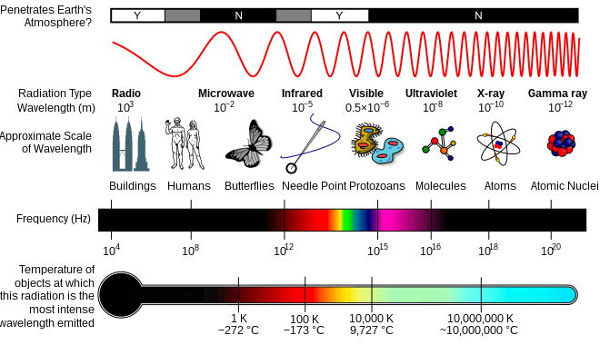
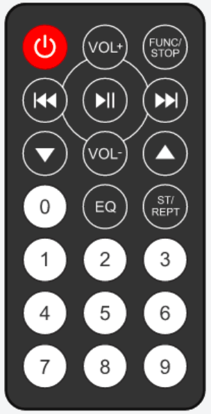
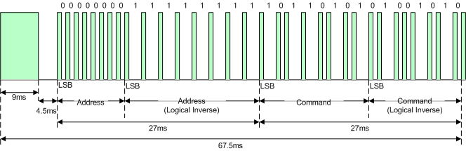
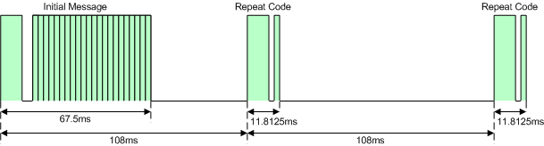
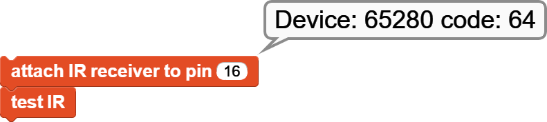
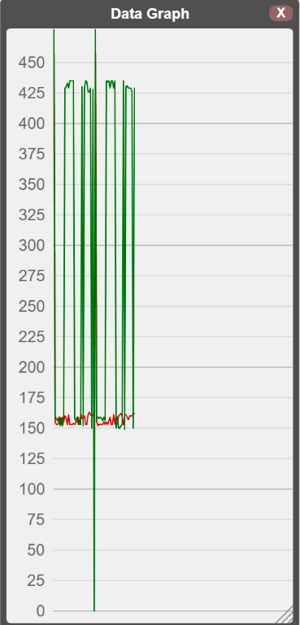

IR Remote Library 红外远程库

## 概述
红外线（有时称为红外光和 IR）是电磁辐射 (EMR)，其波长比可见光长，比无线电波短。因此，人眼看不见它。 IR 通常被理解为涵盖从约 1 毫米 (300 GHz) 到可见光谱标称红边 (约 700 纳米 (430 THz)) 的波长。

（维基百科提供）

下面提供了典型的红外传感器和遥控器图片。

IR 传感器的 OUT 引脚连接到将执行传感器读数的微控制器引脚。用于连接传感器的微控制器引脚号也是库附加块中使用的引脚号。

## NEC IR Protocol  NEC 红外协议
[techdocs.altium.com](http://techdocs.altium.com/)

NEC IR 传输协议使用消息位的脉冲距离编码。每个脉冲串（标记 - RC 发射器打开）的长度为 562.5μs，载波频率为 38kHz (26.3μs)。逻辑位传输如下：
逻辑“0”——562.5μs 脉冲突发，后跟 562.5μs 间隔，总传输时间为 1.125ms
逻辑“1”——562.5μs 脉冲突发，后跟 1.6875ms 间隔，总传输时间为 2.25ms
当按下遥控器上的按键时，传输的消息按顺序包含以下内容：
9ms 超前脉冲突发（用于逻辑数据位的脉冲突发长度的 16 倍）
4.5ms间隔
接收设备的8位地址
地址的 8 位逻辑反转
8位命令
命令的 8 位逻辑逆
最后的 562.5μs 脉冲突发表示消息传输结束。
四个字节的数据位均首先发送最低有效位。图 1 说明了 NEC IR 传输帧的格式，地址为 00h (00000000b)，命令为 ADh (10101101b)。

从图 1 中可以看出，它需要：

27ms 传输 16 位地址（地址 + 逆）和 16 位命令（命令 + 逆）。这来自最终包含八个“0”和八个“1”的每个 16 位块 - 给出 (8 * 1.125ms) + (8 * 2.25ms)。

完全传输消息帧需要 67.5 毫秒（不包括表示消息结束的最后 562.5 微秒脉冲突发）。

* REPEAT CODES 重复代码 
如果按住遥控器上的按键，将发出重复代码，通常在表示消息结束的脉冲突发后 40 毫秒左右。重复代码将继续以 108ms 的间隔发送出去，直到最终松开按键。重复代码按顺序由以下部分组成：
9ms 超前脉冲突发
2.25ms的间隔
562.5μs 脉冲突发来标记空间的结束（以及传输的重复代码的结束）。

图 2 说明了发送初始消息帧后两个重复代码的传输。

## 积木摘要
对于每个块，都有一个简短的描述条目以及详细的块和组件描述。您可以单击简短描述表中的框图来访问详细信息和示例代码。
已提供有关如何使用这些块的示例代码。要试用它们，您只需打开 MicroBlocks IDE 的浏览器会话并将它们拖放到编辑器编程区域即可。然后您只需单击它们即可查看结果。

Short Description 简短的介绍

返回从连接设备读取的 IR 代码。

将 IR 接收器与微控制器设备的指定引脚关联。

将命令代码发送到给定的设备编号。

============== 高级 ==============

显示遥控设备编号和检测到的红外代码的键值。

从特定的遥控设备编号读取 IR 键码值。

从设备读取红外消息。

转储 IR 消息内容

从 IR 消息帧中读取指定字节。

表示读取 4 个字节的消息帧。

发送字节到 IR 设备。

## 使用库积木
该库由一组简单的服务组成，这些服务共同允许用户使用红外遥控器。
- 椭圆形：这些是返回某种信息的报告块。用户通常会将它们分配给项目变量或在其他块的合适输入槽中使用它。返回信息类型为Number。
- 矩形：这些是执行编程功能且不返回任何信息的命令块。

## 块描述
在下面提供的示例中，附加红外接收器块中使用的引脚号仅适用于所使用的测试设置。每个用户自己的引脚号可能不同，具体取决于他们使用的传感器和/或微控制器。

MicroBlocks 提供的库专门与使用 NEC IR 协议运行的控制器配合使用。还有许多其他协议正在使用。如果您的设备不使用 NEC 协议，则它将无法使用此库。

* 连接红外接收器 

将红外传感器与微控制器上的特定引脚相关联。红外传感器库的所有操作都将通过该引脚号执行。
示例代码

* 接收红外码

该块等待下一个 IR 消息并返回其 IR 键代码。您需要将红外键盘指向红外传感器并按其上的任何按钮。

示例代码

* 红外发射

向 IR 设备号码发送命令。

测试红外

等待下一条 IR 消息，然后显示设备编号和收到的按键编码。
示例代码：此示例使用 Arduino 遥控器并显示其设备代码和按下 OK 键的按键代码。

从设备接收红外代码

从特定的遥控设备编号读取 IR 键码值。可以使用测试 IR 块来确定设备编号。

获取 IR 消息

记录由标记和空格信号持续时间组成的 68 字节 IR 消息序列。它是库的内部函数，不提供示例代码。

转储 IR

将原始脉冲时序打印到图形窗口。可用于分析新协议。首先从远程控制设备读取一个值。然后使用这个块来查看数据。您可以使用“将图形数据复制到剪贴板”，然后将数据粘贴到文本编辑器中以查看脉冲时序。

_getIRbyte

从 IR 消息帧中读取指定字节。它是库的内部函数，不提供示例代码。

_got32Bits

验证是否已收到完整的 IR 消息帧。它是库的内部函数，不提供示例代码。

发送字节

从 IR 消息帧中读取指定字节。它是库的内部函数，不提供示例代码。

